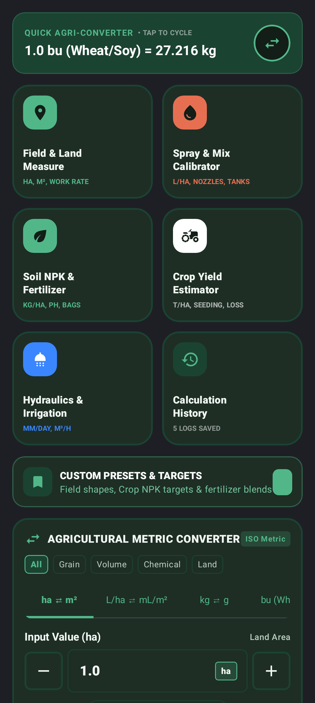
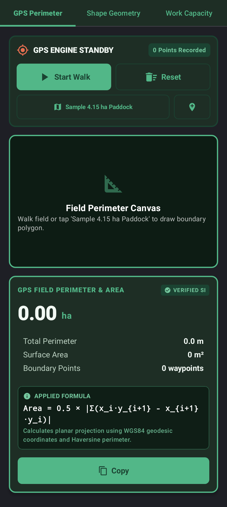
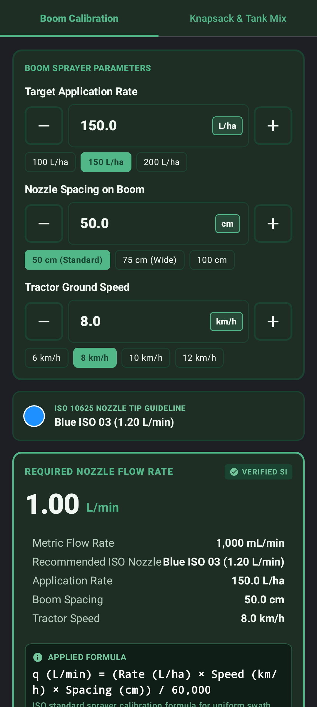
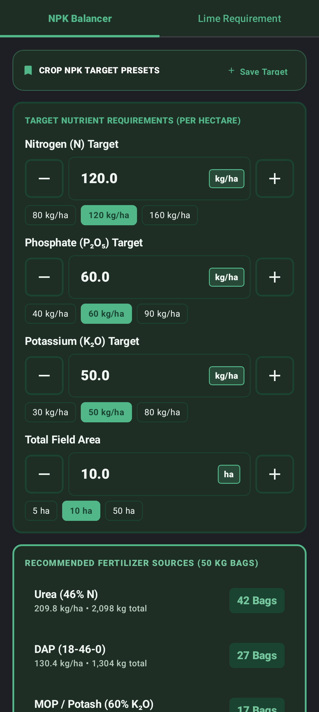
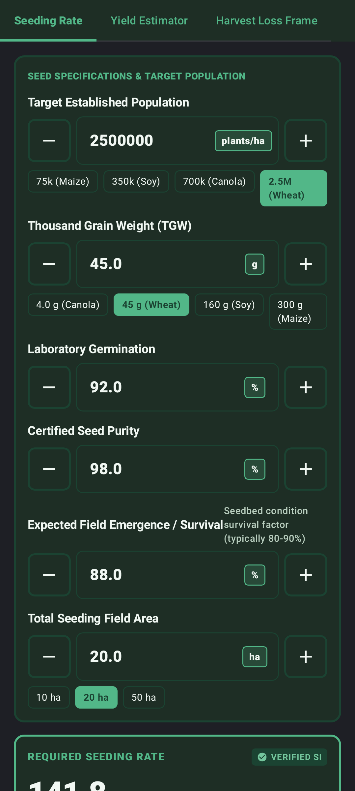
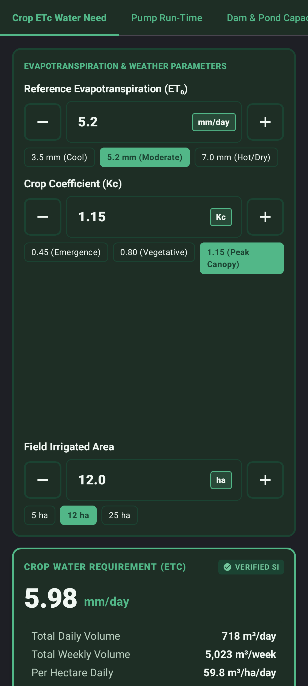
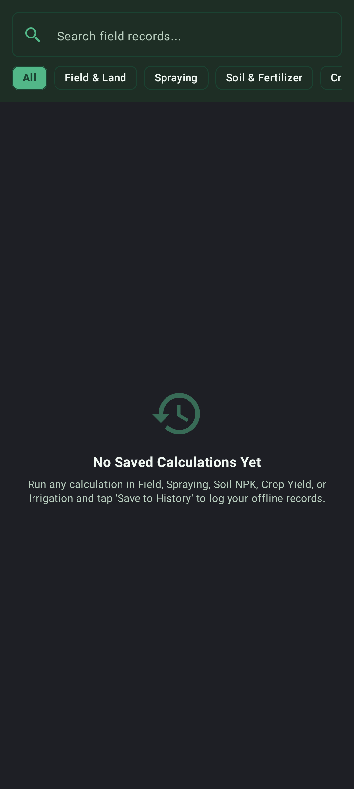

# 🌾 AgriCalc

> **Calculate with ease in the field.**

**AgriCalc** is a full-featured, offline-first Android application designed specifically for farmers, agronomists, field operators, and agricultural researchers. Built natively using **Kotlin**, **Jetpack Compose**, and **Material 3**, AgriCalc brings instant, high-precision mathematical calculations, unit conversions, GPS field measurement, spray calibration, NPK fertilizer balancing, crop yield estimation, and irrigation hydraulics straight to the field without requiring an active internet connection.

---

## 📸 App Screenshots

| Dashboard & Quick Converter | Field & Land Measurement | Spraying & Chemical Calibration |
|:---------------------------:|:-----------------------:|:------------------------------:|
|  |  |  |

| Soil NPK & Fertilizer | Crop Yield Estimator | Hydraulics & Irrigation |
|:--------------------:|:-------------------:|:-----------------------:|
|  |  |  |

| Offline Calculation History |
|:---------------------------:|
|  |

---

## ✨ Key Features & Calculators

AgriCalc provides 6 dedicated calculation suites alongside quick unit conversion and preset management tools:

### 1. ⚡ Quick Agri-Unit Converter & Custom Presets
- **Quick Conversion Widget:** Instant conversion between grain bushels (Wheat, Corn, Soybeans), US Gallons, Liters, Fluid Ounces, Milliliters, Hectares, Acres, Square Meters, and Speed (km/h ⇄ m/s).
- **Custom Presets Manager:** Save and quickly load field dimensions, crop-specific NPK target profiles (Maize, Wheat, Soy, Potato), and common fertilizer chemical blends (Urea, DAP, MOP, CAN, NPK compounds).

### 2. 📐 Field & Land Measurement
- **Geometric Field Area:** Calculate exact areas and perimeters for Rectangles, Triangles, Circles, and Trapezoids (in Hectares, Acres, or Square Meters).
- **GPS Polygon Tracker:** Map field boundaries in real time using GPS coordinates or load sample paddocks; calculates exact perimeter and area using the Haversine distance and Shoelace formulas.
- **Machinery Field Work Rate:** Compute effective field capacity (ha/hr), total time required, and fuel consumption based on implement working width, operating speed, and field efficiency percentage.

### 3. 🚜 Spraying & Chemical Calibrator
- **Nozzle Flow Rate & Application Volume:** Calculate nozzle discharge rate ($L/min$) based on target application rate ($L/ha$), tractor speed ($km/h$), and nozzle spacing ($cm$).
- **Tank Mix & Chemical Batching:** Compute total chemical volume required for a given field size, number of full tank loads needed, and exact chemical dose per tank load.
- **Spray Drift Risk Warning:** Live wind speed and temperature parameter warnings to minimize drift risks.

### 4. 🌱 Soil NPK & Fertilizer Balancer
- **Elemental NPK Deficit:** Compute net $N$, $P_2O_5$, and $K_2O$ deficits based on soil test results and target crop requirements.
- **Fertilizer Bag Requirement:** Determine total kilograms and $50\text{ kg}$ bags required for specific single or compound fertilizer products (e.g., Urea $46\%$, DAP $18$-$46$-$0$, MOP $60\%$).
- **Lime / Gypsum Application Rate:** Calculate soil amendment application rates to adjust soil $pH$ or remediate sodium content.

### 5. 🌾 Crop Yield Estimator
- **Pre-Harvest Plant Count Yield Estimate:** Estimate harvest yield ($t/ha$ or $bu/acre$) using plant population density, heads/ear counts, grains per head, and 1000-kernel weight.
- **Harvest Loss Calculator:** Quantify field grain losses ($kg/ha$) from combine harvester header and rotor losses.
- **Grain Moisture Correction:** Adjust wet grain harvested weight to standard commercial storage moisture levels ($14\%$ standard).

### 6. 💧 Hydraulics & Irrigation
- **Drip & Sprinkler Water Demand:** Compute total field water application requirement ($m^3$, Liters, $mm/day$) based on field area and daily crop evapotranspiration ($ET_c$).
- **Pumping Flow Rate & Hydraulic Head:** Determine required pump flow rate ($m^3/hr$ and $L/s$) and friction head loss across pipe diameter and length using Hazen-Williams hydraulic formulas.

### 7. 📜 Offline Calculation History
- **Room Database Storage:** Automatically log and store all field calculations with input summaries, formula references, and timestamps.
- **Export & Share:** Export field calculation logs as formatted text or PDF/CSV reports.

### ☀️ Sunlight High-Contrast Mode
- One-tap toggle for an ultra-high-contrast outdoor theme designed for maximum readability under direct sunlight in the field.

---

## 🛠️ Architecture & Tech Stack

AgriCalc is structured according to modern Android architecture best practices (MVVM + Clean Architecture principles):

- **Language:** Kotlin 2.2+
- **UI Framework:** Jetpack Compose with Material 3 Design
- **Architecture:** MVVM (Model-View-ViewModel) using `StateFlow` and Coroutines
- **Local Database:** Room Persistence Library (Offline-first architecture)
- **Dependency Processing:** Google KSP (Kotlin Symbol Processing)
- **Testing & Screenshots:** JUnit 4, Robolectric, and Roborazzi for UI screenshot testing
- **Gradle Version:** Gradle 9.3.1 with Android Gradle Plugin (AGP) 9.1.1

```
AgriCalc/
├── app/
│   ├── src/
│   │   ├── main/
│   │   │   ├── java/com/example/
│   │   │   │   ├── data/            # Room Database, DAOs, & Repositories
│   │   │   │   ├── model/           # Data models, Unit converters, Navigation
│   │   │   │   ├── ui/
│   │   │   │   │   ├── components/  # Reusable UI components (Inputs, Headers, NavBars)
│   │   │   │   │   ├── screens/     # Compose screen layouts (Dashboard, Spraying, etc.)
│   │   │   │   │   └── theme/       # Material 3 AgriCalc palette & Sunlight Mode
│   │   │   │   ├── util/            # PDF/Report exporters
│   │   │   │   ├── viewmodel/       # AgriCalcViewModel & business logic
│   │   │   │   └── MainActivity.kt  # Main activity entry point & layout host
│   │   └── test/
│   │       ├── java/com/example/
│   │       │   ├── AgriCalcMathTest.kt    # Agronomic formula unit tests
│   │       │   └── AppScreenshotsTest.kt  # Roborazzi screenshot test suite
│   │       └── screenshots/               # Captured screenshot assets
└── docs/screenshots/                    # Documentation screenshots
```

---

## 🚀 Developer Setup & Building

### Prerequisites
- **Android Studio** (Ladybug / 2024.2.1 or newer recommended)
- **JDK 17** or **JDK 21**
- **Android SDK** API 36 (minSdk 24, targetSdk 36)

### Getting Started

1. **Clone the repository:**
   ```bash
   git clone https://github.com/your-username/AgriCalc.git
   cd AgriCalc
   ```

2. **Build the Debug APK:**
   Using the included Gradle wrapper:
   ```bash
   ./gradlew assembleDebug
   ```

3. **Run Unit Tests:**
   Execute all unit tests and agronomic formula verifications:
   ```bash
   ./gradlew test
   ```

4. **Generate App Screenshots (Roborazzi):**
   To execute screenshot tests and capture rendered screens using Robolectric and Roborazzi:
   ```bash
   ./gradlew recordRoborazziDebug
   ```
   Screenshots will be output to `app/src/test/screenshots/`.

---

## 🤝 Contributing

Contributions, bug reports, and feature requests are welcome! Feel free to open an issue or submit a pull request.

---

## 📄 License

This project is licensed under the [MIT License](LICENSE).
